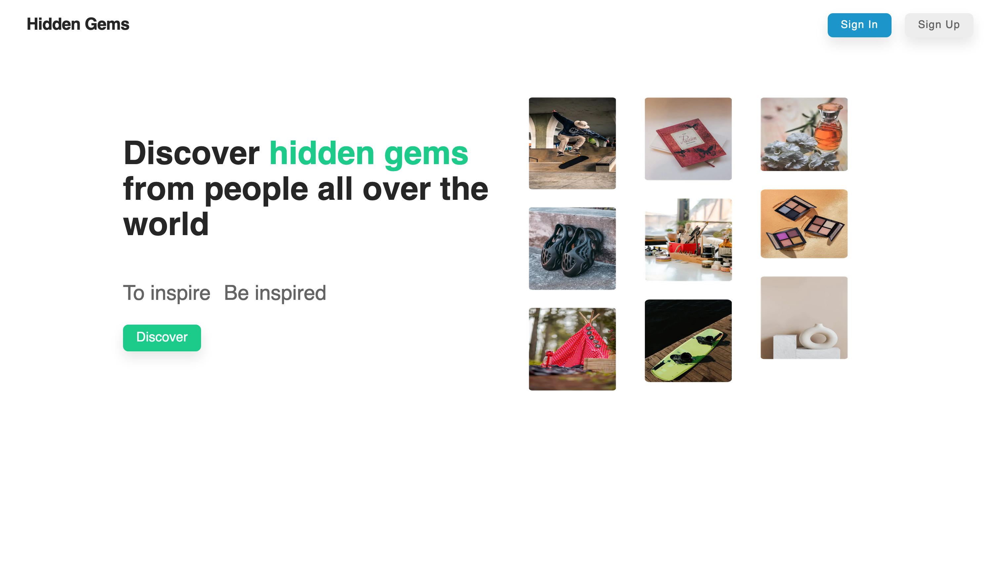
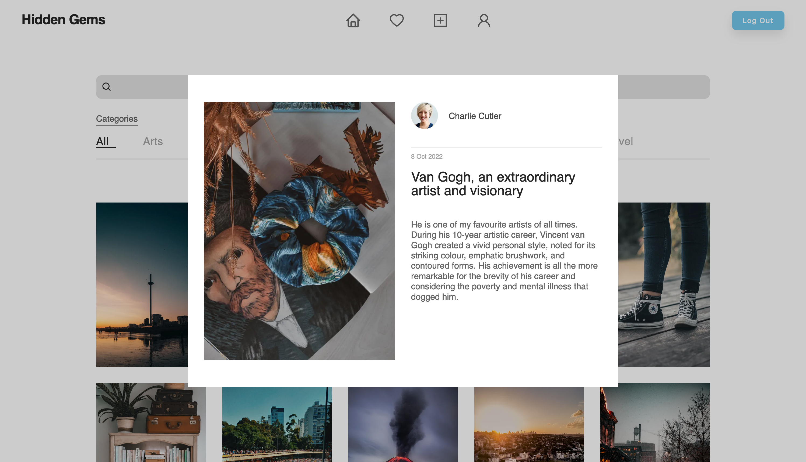
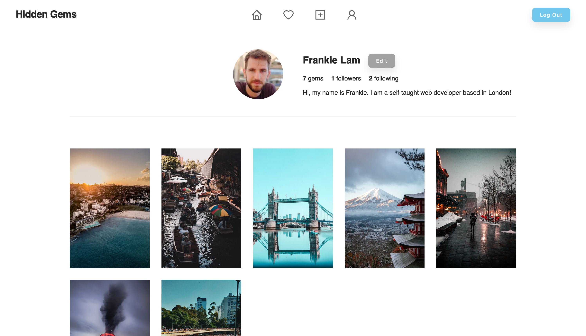
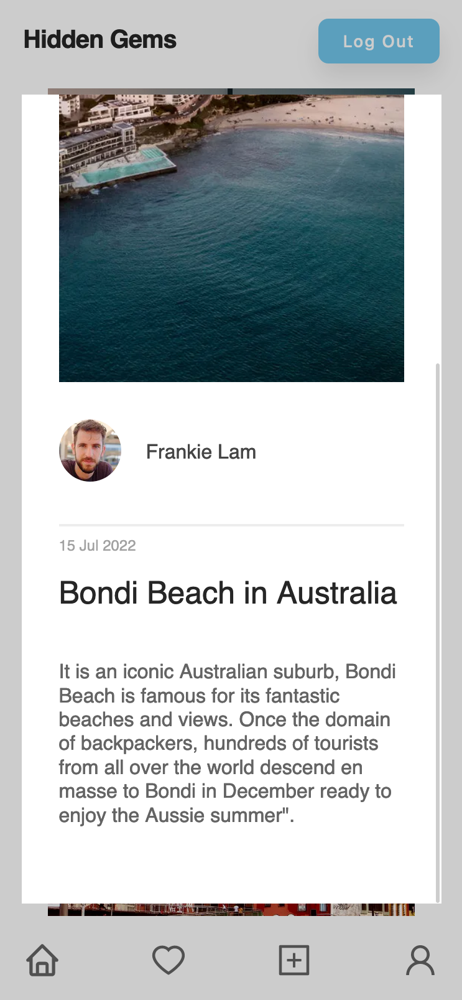
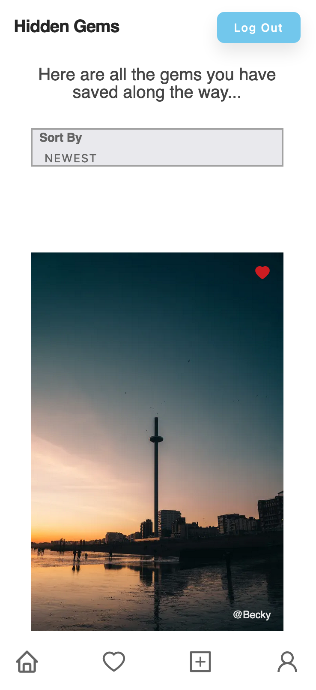
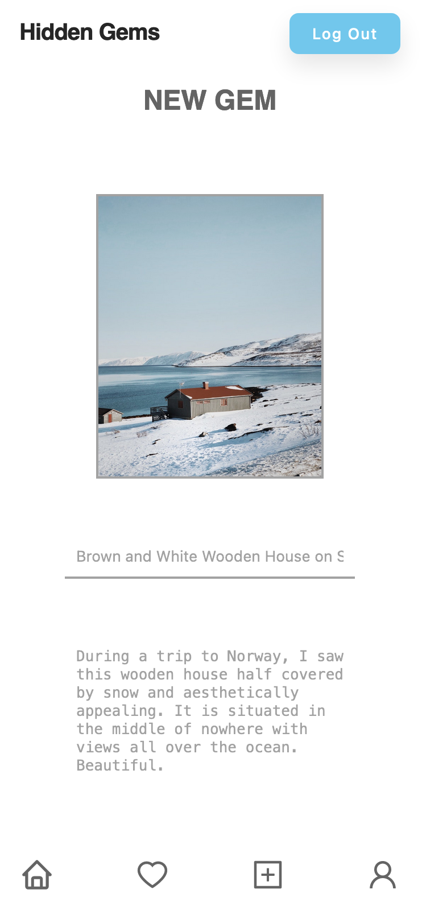

# NextJS App - Hidden Gems (Rebuilt with TypeScript and React Query)

## Table of contents

- [Overview](#overview)
  - [Project background](#project-background)
  - [Project architecture](#project-architecture)
  - [Project structure](#project-structure)
  - [Project tech stack](#project-tech-stack)
  - [Project screenshots](#project-screenshots)
  - [Project links](#project-links)
- [Enhancement](#enhancement)
  - [Type safety with TypeScript](#type-safety-with-typescript)
  - [Data caching and mutating with React Query](#data-caching-and-mutating-with-react-query)
- [Author](#author)

## Overview

### Project background

The is a rebuilt version of my first NextJS app, a multiple-page application serving as a social-media platform where users can share their hidden gems using images, follow each other and save any hidden gems they like in a collection for later retrieval.

It was rebuilt with TypeScript and React Query for better user experience during page switching. Initially, the project was built with React in JavaScript in Jun 2022.

### Project architecture


### Project structure

The website has 6 pages: Home, Collection, NewGem, Gemmer, Account/Signin, Account/Signup.

#### Home

It has 2 main sections: hero and masonry. Either one of them is shown depending on the login-in state of users.

For guest users, hero section will be shown to introduce what is app is all about and has a call-to-action button encouraging users to start discovering the app either by logging in an existing account or creating one.

For logged-in users, masonry section will be shown with hidden gems loaded from the Firestore and then displayed as image cards in a grid layout. When hovering the image card, a save-to-collection button dressed as a “heart” icon and the author’s name of that image card will be displayed. Clicking on the heart icon will get the image card saved into their collection. Clicking on the image card will open a cart modal displaying all the details associated with the image card, including title, description and date.

The masonry can be filtered by search term and category with immediate effect on the UI. If there are no gems matching with the filtering criterion, then a “no matching gems” message will be shown instead.

#### Collection

It is where users can view all the hidden gems they have saved up. Users can unsave any hidden gems in their collection with immediate effect shown on the UI.

By default, saved gems are sorted by date with the newest showing first. However, there is "sort by" selection element giving users an option to sort by Category (alphabetically) if they want to.

#### NewGem

It provides a form where users can create a new gem with input fields of image, title, description and category. Once the new gem form is submitted, then users will be redirected to Home where they can see their newly-created gem showing as the first.

#### Gemmer

It serves as a summary of a gemmer's profile. It is comprised of 2 parts: gemmer profile and his/her gem masonry.

In profile, profile picture, username, biography, and number of gems and followers are shown. If currently-logged-in user has the same user id as the id of the gemmer, then an edit button will be shown to enable the user modifying his/her account details — username, biography and profile picture. Gemmers can follow and unfollow each other by clicking on the buttons (follow/unfollow) in the profile section. Which one is shown depends on the following state between users.

In masonry, only their own hidden gems are shown.

#### Account/Signin

It is the sign-in page of the app currently with the option to sign in through Google. If users are signing in with their google accounts for the first time, user accounts with the app will be automatically created for them. Once their google acounts have been authenticated, users will be redirected to Home where they can discover all the hidden gems shared by other gemmers.

#### Account/Signup

It is the sign-up page of the app. Basically it works the same as account/signin page, but with a welcoming message shown to encourage users signing up with us now to start discovering all the hidden gems shared by others.

### Project tech stack

TypeScript, NextJS, React, React Query, CSS and Firebase.

### Project screenshots

#### Desktop





#### Mobile





### Project links

- Live Site URL: [Hidden Gems](https://hiddengems-ts.vercel.app/)

Here are the website and GitHub for the initial version of the app.

- Live Site URL: [Hidden Gems (JS)](https://hiddengems.vercel.app/)
- GitHub: [Hidden Gems(JS)](https://github.com/frankiecflam/next-hidden-gems)

## Enhancement

### Type safety with TypeScript

Typescript helped eliminating type errors which I experienced a lot with when first building this app with JavaScript, thereby fewer bugs and better developer experience (DX).

```ts
interface GemModalProps {
  onCloseModal: () => void;
  gem: Gem;
  gemmer: Gemmer;
}

const GemModal = ({ onCloseModal, gem, gemmer }: GemModalProps) => {
  return (
    <div className={styles.modal} onClick={onCloseModal}>
      <div className={styles.imageContent}>
        <Image src={gem.image} alt="" layout="fill" objectFit="cover" />
      </div>
      <GemModalDetails
        gem={gem}
        gemmerId={gemmer.id}
        gemmerImage={gemmer.image}
        gemmerUsername={gemmer.username}
      />
    </div>
  );
};

export default GemModal;
```

### Data caching and mutating with React Query

With React Query, API query results are cached during page switching across the entire app with the ability to invalidate query results and re-fetch data when server-side data is mutated.

```ts
export default function useGems() {
  return useQuery(
    ["gems"],
    () => axios.get("/api/gems").then((res) => res.data.gems as Gem[]),
    {
      select: (gems: Gem[]) => {
        return sortGemsByDate(gems);
      },
    }
  );
}

export default function useCreateGem() {
  const queryClient = useQueryClient();

  return useMutation(
    (newGem: Gem) =>
      axios
        .post("/api/gems", {
          newGem,
        })
        .then((res) => res.data.gems),
    {
      onSuccess: (gems: Gem[]) => {
        queryClient.invalidateQueries(["gems"]);
      },
    }
  );
}
```

## Author

- Email - [Frankie Lam] cfl.frankie@gmail.com
- Instagram - [@frankie\_\_\_lam](https://www.instagram.com/frankie___lam/)
- Facebook - [Frankie Lam](https://www.facebook.com/frankiecflam/)
